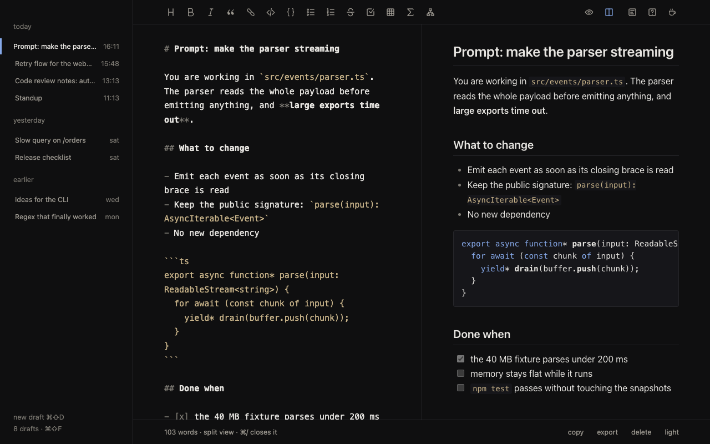

# Scratchpad

A markdown scratchpad one click away on the Chrome toolbar. No account, no
network, your data never leaves your machine.

[](https://github.com/m4rcone/scratchpad-newtab/actions/workflows/ci.yml)
[](LICENSE)
[](https://ko-fi.com/m4rcone)



Version **1.0.0**. Desktop only — Chrome on Android and iOS does not run
extensions.

## Principles

1. Nothing waits on the disk.
2. Saving is automatic and silent.
3. No network requests. No telemetry. No permission beyond what is needed.
4. Markdown is the editing format.

## What it does

- Opens from the toolbar icon or `⌥⇧S` (`Alt+Shift+S` on Windows and Linux),
  and reuses its tab if it is already open.
- Reopens the draft you left, caret in place. Saving is automatic, down to the
  last keystroke.
- Highlights markdown as you type and keeps the markers visible, dimmed.
- Three views: writing, writing with the preview beside it, and the preview
  alone for reading.
- The preview renders GitHub-flavoured markdown, code highlighting, LaTeX
  maths, mermaid diagrams and `:emoji:`. Embedded HTML is sanitized.
- Multiple drafts, titled by their first line, with full-text search.
- Copy a draft or export it as `.md`.
- Light and dark themes that follow the system.

Remote images in a draft are not loaded: the extension makes no network
requests at all.

## Shortcuts

On Windows and Linux, `⌘` is `Ctrl` and `⌥` is `Alt`.

| shortcut | what it does                                             |
| -------- | -------------------------------------------------------- |
| `⌥⇧S`    | open Scratchpad from anywhere in Chrome ¹                |
| `⌘⇧D`    | new draft                                                |
| `⌘⇧F`    | search drafts                                            |
| `⌘/`     | preview beside the text                                  |
| `⌘⇧P`    | reading view                                             |
| `⌘⇧A`    | copy the whole draft                                     |
| `⌘S`     | export as `.md`                                          |
| `esc`    | back to writing; close the rail; cancel a pending delete |

¹ Change it at `chrome://extensions/shortcuts`. Formatting shortcuts (`⌘B`,
`⌘I`, `⌘K`…) are listed under `?` on the toolbar.

## Install

Requires Node 20+ and Chrome 120+.

```bash
git clone https://github.com/m4rcone/scratchpad-newtab.git
cd scratchpad-newtab
npm install
npm run build
```

In `chrome://extensions`, turn on developer mode, choose **Load unpacked** and
pick `dist/`. Then pin Scratchpad from the puzzle-piece menu so its icon stays on
the toolbar.

## Development

| command                           | what it does                         |
| --------------------------------- | ------------------------------------ |
| `npm run dev`                     | Vite dev server                      |
| `npm run build`                   | type-check and build `dist/`         |
| `npm test`                        | unit tests                           |
| `npm run lint` / `npm run format` | ESLint / Prettier                    |
| `npm run package`                 | zip `dist/` for the Chrome Web Store |
| `npm run icons`                   | regenerate the icons                 |

The dev server runs without the extension's content security policy, so check
anything network-related against `dist/`.

## Privacy

Drafts stay in your Chrome profile. The only permission is `storage`, which
keeps the theme and the open draft in `chrome.storage.local`; there is no host
permission and no access to the pages you visit. Details in
[PRIVACY.md](PRIVACY.md).

## Support

Scratchpad is free. If it saves you time, you can buy me a coffee on
[Ko-fi](https://ko-fi.com/m4rcone) — or through the cup on the toolbar.

## License

[MIT](LICENSE) © Marcone Boff
